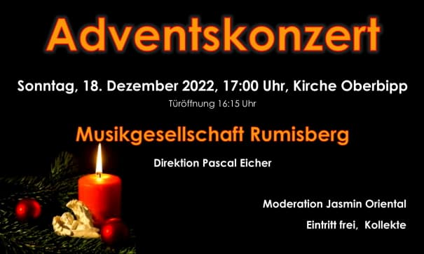

Die Musikgesellschaft Rumisberg lädt ein zum traditionellen Adventskonzert in der reformierten Kirche in Oberbipp.

Mit dem diesjährigen Adventskonzert geht die sehr erfolgreiche Zusammenarbeit mit dem Dirigenten Pascal Eicher zu Ende. Der Träger des Stephan Jäggi Preises 2021 und erfahrene Brass Band-Musiker dirigiert die Musikgesellschaft Rumisberg auf Projektbasis seit dem Jahr 2015. 12 Konzerte, zwei erfolgreiche Teilnahmen an Konzertwettbewerben und eine Steigerung des musikalischen Niveaus sind das schöne Resultat.

Die Musikantinnen und Musikanten freuen sich auf einen schönen Konzertabend und auf viele Besucherinnen und Besucher.

